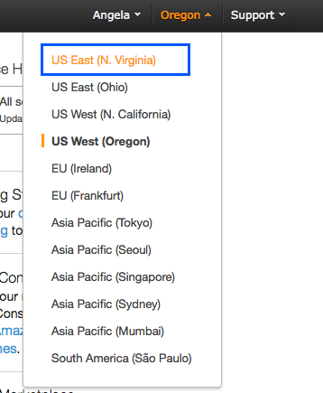
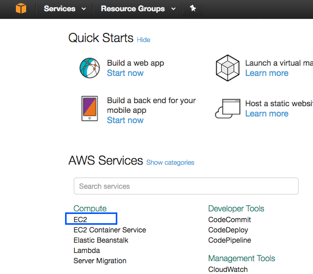
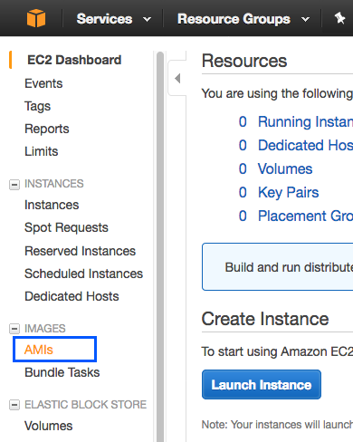
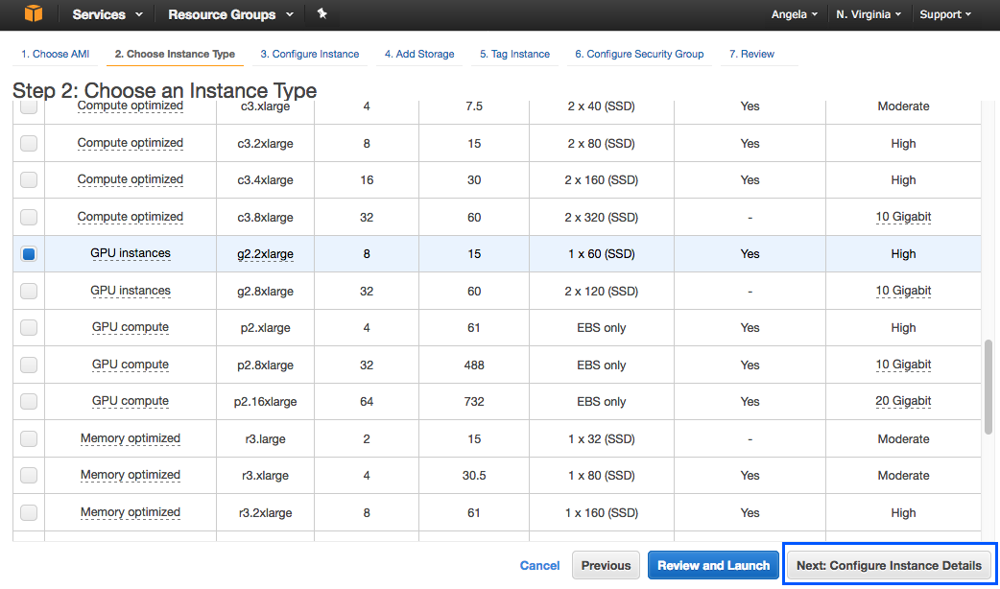
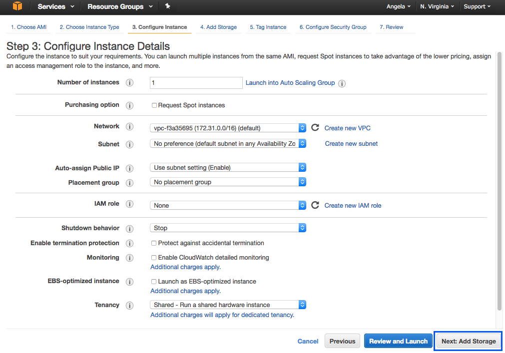
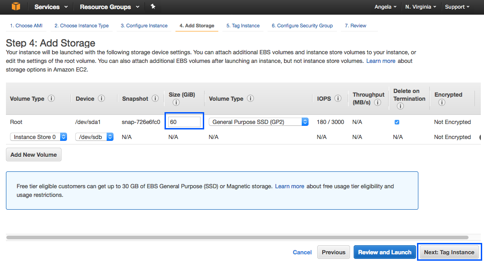
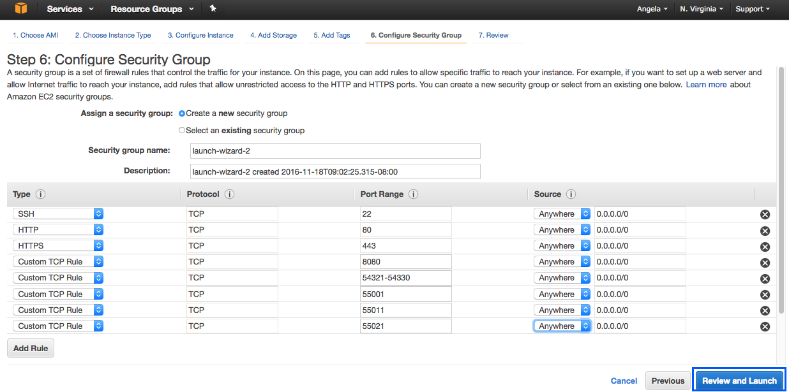
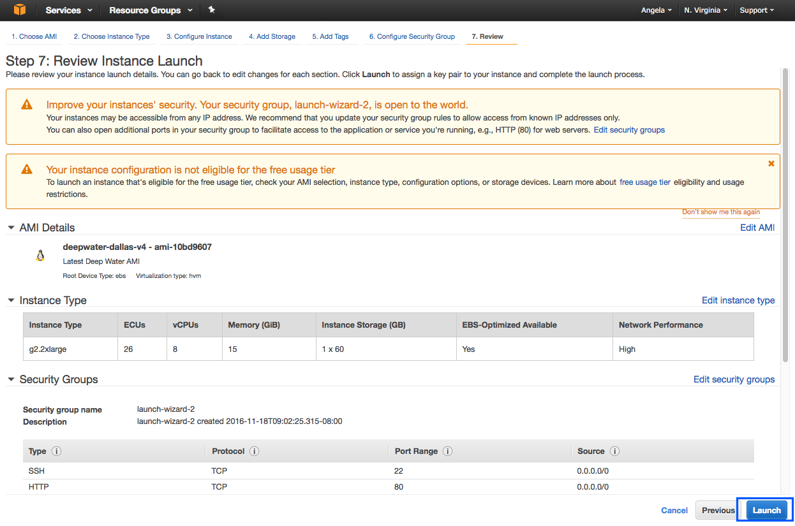
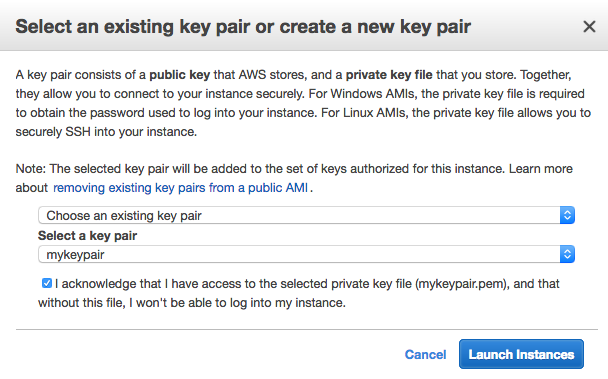

# Deep Water Workshop on EC2 Amazon AMI

A Deep Water workshop was presented at H2O Open Tour Dallas. The hands-on workshop is available in a public EC2 Amazon AMI. This document describes how to load and run this workshop. Note that this requires an account on Amazon AWS. 

1. Log in to your your AWS account at [https://aws.amazon.com](https://aws.amazon.com).
2. In the upper right corner of the Amazon Web Services page, change the location in the location drop-down to US East (N Virginia).

 

3. Select the EC2 option under the Compute section to launch the EC2 Dashboard.

 

4. Select **Images > AMIs** on left navigation.

 

5. On the Launch screen, change the dropdown at the top to **Public images** , then search for the Deep Water AMI using the ID: ami-10bd9607. Click Enter to begin the search.

 

6. After the AMI is located, click the **Launch** button.

7. At this point, you will be directed to choose your GPU instance type. Select an instance, for example g2.2xlarge, then click **Next: Configure Instance Details**.

 

8. Accept the default configuration for this instance, then click **Next: Add Storage**. 

 

9. Specify a value greater than or equal to 50 GB for the Size value (storage size), then click **Next: Tag Instance**.

 

10. Enter a unique name tag to identify your instance, then click **Next: Configure Security Group**.

 

11. Update the security group, and add rules as indicated in the following table (refer also to the image below the table):

 | Type            | Protocol  | Port Range    | Source             |
 | ----------------|-----------|---------------|--------------------|
 | SSH             | TCP       | 22            | Anywhere 0.0.0.0/0 |      
 | HTTP            | TCP       | 80            | Anywhere 0.0.0.0/0 |  
 | HTTPS           | TCP       | 443           | Anywhere 0.0.0.0/0 | 
 | Custom TCP Rule | TCP       | 8080          | Anywhere 0.0.0.0/0 |
 | Custom TCP Rule | TCP       | 54321-54330   | Anywhere 0.0.0.0/0 | 
 | Custom TCP Rule | TCP       | 55001         | Anywhere 0.0.0.0/0 | 
 | Custom TCP Rule | TCP       | 55011         | Anywhere 0.0.0.0/0 |
 | Custom TCP Rule | TCP       | 55021         | Anywhere 0.0.0.0/0 |

 These rules are necessary to open the Flow UI, Prediction Services, Jupyter Notebook server and log in to the instance via command line. Click **Review and Launch**.

 

12. Review the configuration, and then click **Launch**.

 
 
13. A popup will appear prompting you to select a key pair. This will be used to log in to the instance via command line. You can select your existing key pair or create a new one. Be sure to accept the acknowledgement, then click **Launch Instances** to start the new instance.

 

After the instance starts, you can view/start/stop/terminate the instance from the EC2 Dashboard by clicking on **Running Instances**.

To open a Jupyter Notebook server, enter ``<Public_IP_Address>:80`` in the address bar of your browser window. A message box will appear, prompting you to provide authentication. Enter ``deepwater`` for the username, and enter the AWS Instance ID as the password.

To open the Flow UI, enter ``<Public_IP_Address>:54321`` in the address bar of your browser window.

You can log in to this instance using ssh with Terminal (Mac/Linux) or Putty (Window). For example:

  ``ssh -i <Private_Key_File> ubuntu@<Public_IP_Address>``

Note that the public IP address will change on reboot. Also, the key pair file should have restricted permissions (``chmod 400 <Private_Key_File>``). 

